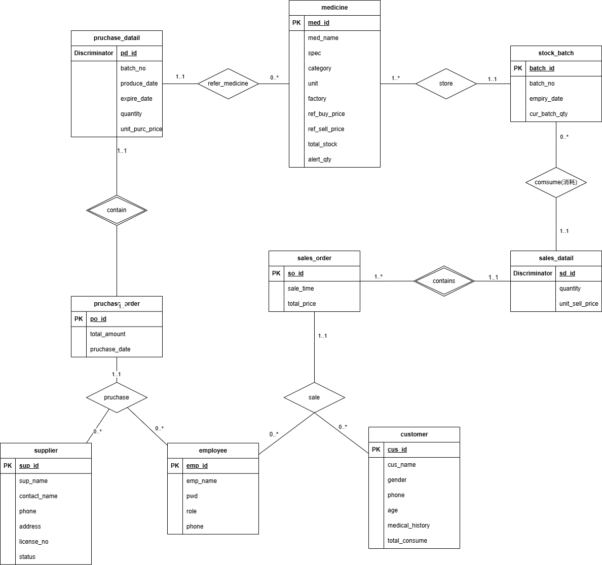

## 1. E-R图

### 强实体集

* medicine：包含属性(**med_id**, med_name, spec, category, unit, factory, ref_buy_price, ref_sell_price, total_stock, alert_qty)

* **supplier**：包含属性 (**sup_id**, sup_name, contact_name, phone, address, license_no, status)
* **employee**：包含属性 (**emp_id**, emp_name, pwd, role, phone)
* **customer**：包含属性 (**cus_id**, cus_name, gender, phone, age, medical_history, total_consume)
* **purchase_order**：包含属性 (**po_id**, total_amount, purchase_date)
* **sales_order**：包含属性 (**so_id**, sale_time, total_price)
* **stock_batch**：包含属性 (**batch_id,** batch_no, expiry_date, cur_batch_qty, create_time)
* **inventory_check**：包含属性 (**check_id**, book_qty, actual_qty, diff_qty, diff_amount, emp_id, check_time, remark)
* **purchase_return**：包含属性 (**pr_id**, batch_no, quantity, return_time, reason)
* **sales_return**：包含属性 (**sr_id**, batch_no, quantity, return_time, reason)
* **finance_daily**：包含属性 (**day_id**, sales_revenue, sales_profit, sales_return_amt, purc_return_amt, inv_loss_amt, inv_gain_amt, net_profit)

### 弱实体集

* **purchase_detail**：包含属性 (***pd_id***, batch_no, produce_date, expire_date, quantity, unit_purc_price)

* **sales_detail**：包含属性 (***sd_id***, batch_no, quantity, unit_sell_price)

> 注：pd_id 和 sd_id为分辨符 (Discriminator)。

### 联系集

* **sale**：关联 employee，customer 和 sales_order
* **purchase**：关联 supplier，employee 和 purchase_order
* **contain_purc**：关联 purchase_order 和 pruchase_datail
* **contains_sales**：关联 sales_order 和 sales_datail
* **purc_med**：关联 pruchase_datail 和 medicine
* **stock_med**：关联 stock_batch 和 medicine
* **sales_med**：关联 sales_datail 和 medicine
* **store**：关联 pruchase_datail 和 stock_batch
* **consume**：关联 stock_batch 和 sales_datail
* **check**：关联 stock_batch，employee 和 inventory_check
* **pur_return**：关联 purchase_order 和 purchase_return
* **sales_return**：关联 sales_order 和 sales_return
* **return to**：关联 purchase_return 和 supplier
* **handle**：关联 employee 和 sales_return

## 2. 核心业务逻辑

### 2.1 基础信息管理

该模块是系统的根基，负责维护静态的实体元数据。

- **实体构成**：主要包括药品 (`medicine`)、员工 (`employee`)、客户 (`customer`) 和供应商 (`supplier`)。
- **逻辑属性**：例如药品实体包含 `alert_qty`（预警数量）用于库存监控，客户实体记录 `medical_history`（病史）以辅助药学服务。
- **逻辑关联**：这些实体作为强实体，通过各种联系集（如 `sale`、`pruchase`）参与到动态业务中。

### 2.2 进货管理

该模块实现了药品从供应商进入仓库的完整凭证链。

- **采购达成 (`purchase`)**：关联供应商、员工与采购订单 (`purchase_order`)，明确了“谁在何时向谁订了货”。
- **明细分解 (`contain_purc`)**：采购订单通过此联系分解为具体的进货明细 (`pruchase_datail`)。
- **药品定位 (`purc_med`)**：进货明细通过此联系精确指向 `medicine` 实体，确认采购的具体品种。

### 2.3. 库房管理

库房管理负责处理药品的实物化流转与资产核对。

- **入库转化 (`store`)**：进货明细通过 `store` 联系转化为具体的库存批次 (`stock_batch`)，赋予药品批号和有效期。因此，同一种药可能有多批库存记录。
- **批次关联 (`stock_med`)**：确保每个库存批次都能准确对应到 `medicine` 基础信息。
- **库存盘点 (`check`)**：员工针对特定批次进行核对，产生盘点记录 (`inventory_check`) 以反映账实差异。
- **购进退货 (`pur_return`)**：针对有问题的采购订单，通过 `pur_return` 联系产生退货记录，并通过 `return to` 联系退还给特定供应商。此时库存应减少该批的药品数量
- **销售退货**：顾客退货后，库存应增加该批的药品数量。

### 2.4. 销售管理

销售逻辑核心在于“单据-明细-批次”的递进式扣减。

- **销售登记 (`sale`)**：关联客户、员工与销售订单 (`sales_order`)。
- **明细拆分 (`contain_sales`)**：销售订单细化为销售明细 (`sales_datail`)，并由 `sales_med` 联系确认药品品种。
- **批次出库 (`consume`)**：销售明细通过此联系精准扣减特定批次 (`stock_batch`) 的数量，这是实现药品溯源的关键。
- **销售退货 (`sales_return`)**：关联原销售订单，由员工通过 `handle` 联系进行退货处理。

### 2.5. 财务统计

财务模块通过聚合上述所有业务产生的金额数据，生成宏观报表。

- **实体功能 (`finance_daily`)**：苏日安在 E-R 图中它是一个相对独立的实体，但其内部属性（如 `sales_revenue`、`sales_profit`、`inv_loss_amt` 等）逻辑上涵盖了销售、退货及盘点盈亏的所有财务结果。
- **业务价值**：通过对各项经营行为的金额汇总，实现当日统计、当月统计及报表导出功能。

## 3. 数据库表设计

### 一、 基础信息类表

#### 表1：药品信息表 (t_medicine)

**描述**：存储药品的基本静态属性，是整个系统的核心数据源。

| **字段名**         | **数据类型**  | **约束**           | **描述**                        |
| ------------------ | ------------- | ------------------ | ------------------------------- |
| **med_id**         | INT           | PK, Auto_Increment | 药品唯一标识                    |
| **med_name**       | VARCHAR(100)  | NOT NULL           | 药品通用名                      |
| **spec**           | VARCHAR(50)   | NOT NULL           | 规格 (如 0.25g*12片)            |
| **category**       | VARCHAR(20)   | -                  | 类别 (处方药/OTC)               |
| **unit**           | VARCHAR(10)   | -                  | 单位 (盒/瓶/支)                 |
| **factory**        | VARCHAR(100)  | -                  | 生产厂家                        |
| **ref_buy_price**  | DECIMAL(10,2) | CHECK > 0          | 参考进价                        |
| **ref_sell_price** | DECIMAL(10,2) | CHECK > 0          | 参考零售价                      |
| **total_stock**    | INT           | DEFAULT 0          | 全库总库存 (冗余字段，方便查询) |
| **alert_qty**      | INT           | DEFAULT 10         | 库存预警线                      |

#### 表2：员工表 (t_employee)

**描述**：管理系统用户身份、登录凭证及操作权限。

| **字段名**   | **数据类型** | **约束**                | **描述**                  |
| ------------ | ------------ | ----------------------- | ------------------------- |
| **emp_id**   | INT          | PK                      | 工号 (登录账号)           |
| **emp_name** | VARCHAR(50)  | NOT NULL                | 员工姓名                  |
| **pwd**      | VARCHAR(64)  | NOT NULL                | 登录密码 (建议加密存储)   |
| **role**     | ENUM         | 'Admin','Sales','Stock' | 角色 (管理员/销售员/库管) |
| **phone**    | VARCHAR(20)  | UNIQUE                  | 联系电话                  |

#### 表3：供应商表 (t_supplier)

**描述**：存储药品的来源渠道信息，用于进货管理及资质追溯。

| **字段名**       | **数据类型** | **约束**           | **描述**                       |
| ---------------- | ------------ | ------------------ | ------------------------------ |
| **sup_id**       | INT          | PK, Auto_Increment | 供应商唯一标识                 |
| **sup_name**     | VARCHAR(100) | NOT NULL, UNIQUE   | 供应商全称                     |
| **contact_name** | VARCHAR(50)  | -                  | 业务联系人姓名                 |
| **phone**        | VARCHAR(20)  | NOT NULL           | 联系电话（用于采购沟通）       |
| **address**      | VARCHAR(200) | -                  | 供应商详细地址                 |
| **license_no**   | VARCHAR(50)  | -                  | 医药经营许可证号（合规性检查） |
| **status**       | TINYINT      | DEFAULT 1          | 状态（1:合作中，0:停止往来）   |

#### 表 4：客户表 (t_customer)

**描述**：存储终端购药客户或长期合作单位的信息，用于销售统计及客户关系维护。

| **字段名**          | **数据类型**  | **约束**           | **描述**                        |
| ------------------- | ------------- | ------------------ | ------------------------------- |
| **cus_id**          | INT           | PK, Auto_Increment | 客户唯一标识                    |
| **cus_name**        | VARCHAR(50)   | NOT NULL           | 客户姓名 / 单位名称             |
| **gender**          | ENUM          | '男','女','未知'   | 性别                            |
| **phone**           | VARCHAR(20)   | UNIQUE             | 手机号                          |
| **age**             | INT           | CHECK (age > 0)    | 年龄                            |
| **medical_history** | TEXT          | -                  | 简要病史/过敏史（保证用药安全） |
| **total_consume**   | DECIMAL(12,2) | DEFAULT 0.00       | 累计消费金额（用于财务分析）    |

### 二、 进货核心业务表

#### 表5：进货单主表 (t_purchase_order)

**描述**：记录采购行为的整体信息（谁、什么时候、找谁买、总共多少钱）。

| **字段名**        | **数据类型**  | **约束**                  | **描述**                                          |
| ----------------- | ------------- | ------------------------- | ------------------------------------------------- |
| **po_id**         | VARCHAR(20)   | PK                        | 进货单号 (业务唯一主键，格式：P+年月日+4位流水号) |
| **sup_id**        | INT           | FK -> t_supplier          | 供应商ID (标识这批货是从哪家公司采购的)           |
| **emp_id**        | INT           | FK -> t_employee          | 经手库管员工号 (记录是谁负责本次入库登记的)       |
| **total_amount**  | DECIMAL(12,2) | -                         | 该单总采购金额                                    |
| **purchase_date** | DATETIME      | DEFAULT CURRENT_TIMESTAMP | 入库日期                                          |

#### 表6：进货明细表 (t_purchase_detail)

**描述**：记录每一单中具体药品的批次、价格及有效期信息。

| **字段名**          | **数据类型**  | **约束**               | **描述**                |
| ------------------- | ------------- | ---------------------- | ----------------------- |
| **pd_id**           | INT           | PK, Auto_Increment     | 明细唯一ID              |
| **po_id**           | VARCHAR(20)   | FK -> t_purchase_order | 所属进货单号            |
| **med_id**          | INT           | FK -> t_medicine       | 药品ID                  |
| **batch_no**        | VARCHAR(30)   | NOT NULL               | 生产批号（日期+流水号） |
| **produce_date**    | DATE          | -                      | 生产日期                |
| **expiry_date**     | DATE          | NOT NULL               | 有效期至                |
| **quantity**        | INT           | CHECK > 0              | 入库数量                |
| **unit_purc_price** | DECIMAL(10,2) | NOT NULL               | 本次进货单价            |

### 三、库存核心业务表

#### 表7：库存批次表 (t_stock_batch)

**描述**：**系统枢纽**，记录每一具体批次药品的实时剩余实物数量。

| **字段名**         | **数据类型** | **约束**           | **描述**            |
| ------------------ | ------------ | ------------------ | ------------------- |
| **batch_id**       | INT          | PK, Auto_Increment | 批次ID              |
| **med_id**         | INT          | FK -> t_medicine   | 药品ID              |
| **batch_no**       | VARCHAR(30)  | NOT NULL           | 批号（日期+流水号） |
| **expiry_date**    | DATE         | -                  | 有效期              |
| **cur_batch__qty** | INT          | CHECK >= 0         | 该批次剩余实物数量  |

------

### 四、 销售与财务类表

#### 表8：销售单主表 (t_sales_order)

**描述**：记录每一笔面向客户的交易概况。

| **字段名**      | **数据类型**  | **约束**         | **描述**                    |
| --------------- | ------------- | ---------------- | --------------------------- |
| **so_id**       | VARCHAR(20)   | PK               | 销售单号 (如 S202512200001) |
| **emp_id**      | INT           | FK -> t_employee | 销售员工号                  |
| **cus_id**      | INT           | FK ->t_customer  | 客户ID                      |
| **sale_time**   | DATETIME      | DEFAULT NOW()    | 交易时间                    |
| **total_price** | DECIMAL(12,2) | -                | 销售总额                    |

#### 表9：销售明细表 (t_sales_detail)

**描述**：记录交易的具体药品及扣减的批次信息，用于售后追溯。

| **字段名**          | **数据类型**  | **约束**            | **描述**         |
| ------------------- | ------------- | ------------------- | ---------------- |
| **sd_id**           | INT           | PK, Auto_Increment  | 明细唯一ID       |
| **so_id**           | VARCHAR(20)   | FK -> t_sales_order | 所属销售单号     |
| **batch_id**        | INT           | FK -> t_stock_batch | 从哪个批次扣的货 |
| **med_id**          | INT           | FK -> t_medicine    | 药品ID           |
| **quantity**        | INT           | CHECK > 0           | 销售数量         |
| **unit_sell_price** | DECIMAL(10,2) | -                   | 交易时单价       |

