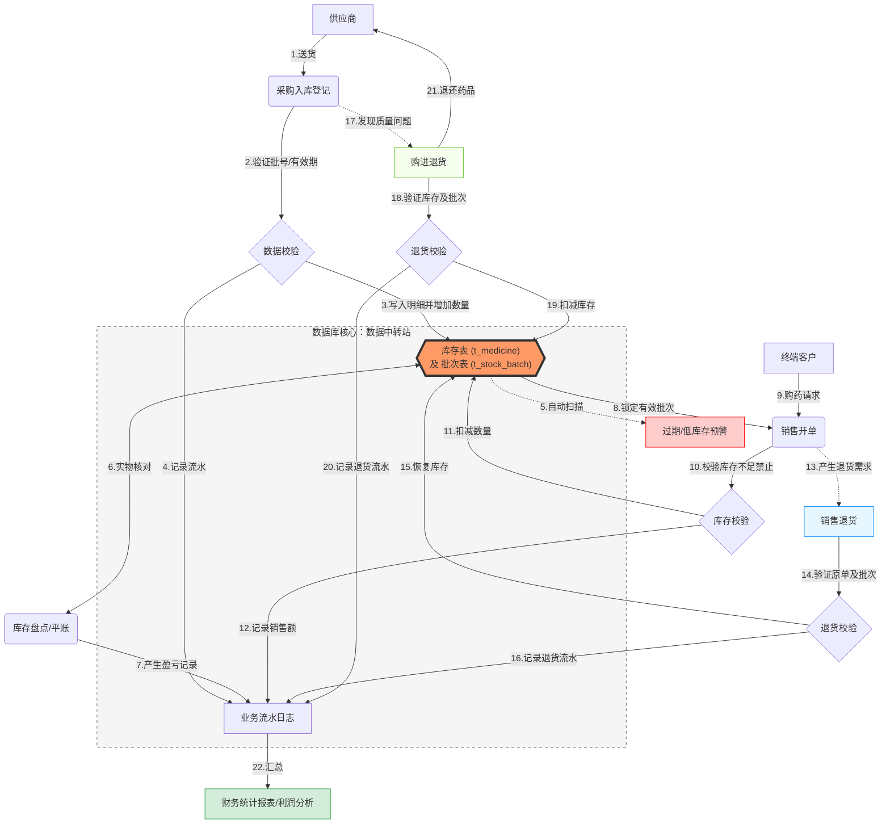

# 《数据库系统》课程设计报告

## 基本信息

**题目**：医药销售管理系统


**小组成员信息**：

| 姓名 | 学号 | 分工 |
|------|------|------|
| 周宏杰 | 23336346 | 承担数据库管理员工作，完成数据库关系模式和物理模式设计，并且实现了软件的部分功能 |
| 郑晓丰 | 23336332 | 承担数据架构师工作，完成数据模型设计和ER图绘制，并且实现了软件的部分功能 |
| 郑思扬 | 23336331 | 承担业务分析师工作，完成业务逻辑分析，并且实现了软件的部分功能 |

## 一、开发环境与开发工具

### 1.1 开发环境

* **编程语言**: Python (建议版本：3.12+)
* **Web 框架**: Flask 3.0
* **数据库**: MySQL (用于存储业务数据，包含触发器、存储过程和视图)
* **ORM (对象关系映射)**: SQLAlchemy 2.0
* **数据库驱动**: PyMySQL
* **身份验证**: Flask-Login

### 1.2 开发工具

- **IDE**: VS Code、PyCharm
- **依赖管理**: pip (通过 requirements.txt 管理)
- **版本控制**: Git
- **数据库管理**: MySQL Workbench

### 1.3 项目运行配置

1. 初始化数据库：连接数据库，然后执行项目中的init.sql文件

```cmd
mysql -u root -p
Enter password: ******

mysql> source init.sql的绝对路径
```

2. 配置python环境：创建一个虚拟环境，python版本选择3.12及以上，然后在项目路径下执行安装命令

```cmd
pip install -r requirements.txt
```

3. 数据库密码设置：将密码设置为默认的1234或者在系统变量中添加`MYSQL_PASSWORD`，变量值为自己的数据库密码
4. 运行项目：在项目路径下运行`run.py`

```cmd
python run.py
```

## 二、系统需求分析（5分）

### 2.1 业务背景

药品销售管理系统面向药店、医药零售企业等场景，旨在解决传统药品销售流程中人工记账效率低、库存管理混乱、数据统计不及时、合规性管控不足等问题，实现药品采购、销售、库存、客户、财务等全流程数字化管理，保障药品经营的合规性、高效性和可追溯性。

### 2.2 核心业务目标

- 规范药品进销存流程，符合医药行业监管要求；
- 实时监控药品库存，避免缺货、过期、积压等问题；
- 自动化销售记账、财务统计，减少人工误差；
- 实现客户信息、药品信息、销售记录的统一管理与快速查询；
- 生成多维度经营报表，如日/月销售统计和畅销榜单，辅助企业决策。

### 2.3 非功能需求

#### 2.3.1 性能需求

- 系统响应时间：单条查询 / 操作响应≤1 秒，批量数据导入 / 统计≤10 秒；
- 并发处理能力：支持至少 30 名用户同时操作，核心业务（销售扣减库存、库存）无卡顿
- 数据存储：支持千万级销售 / 库存记录存储，数据库需配置索引优化与读写分离预留，确保数据增长后查询性能衰减率低

#### 2.3.2 安全性需求

- 权限管控：按角色（管理员、销售员、库管员、财务）分配操作权限，严禁通过 URL 越权访问未授权页面。；
- 数据安全：销售 / 客户 / 药品数据加密存储，操作日志全程记录，支持数据备份与恢复；
- 合规性：药品销售记录可追溯，符合医药行业 “药品追溯码”“处方销售登记” 等监管要求。

#### 2.3.3 易用性需求

- 界面简洁：操作流程符合医药行业人员使用习惯，减少培训成本；
- 容错性：输入错误时给出明确提示，关键操作（如删除、作废单据）需二次确认；
- 兼容性：支持 Windows/Linux 主流操作系统，适配主流浏览器（Chrome、Edge）。

#### 2.3.4 可维护性需求

- 模块化设计：核心功能模块（库存、销售、用户）解耦，便于后续扩展；
- 日志管理：系统运行日志、错误日志、操作日志分类记录，便于问题排查；
- 配置灵活：关键参数（如库存预警阈值、折扣规则）支持后台配置，无需修改代码或重启服务。

### 2.4 运行环境需求

- 服务器端：Python 3.12+、MySQL 8.0+、FastAPI/Django（Web 框架）；
- 客户端：浏览器（Chrome、Edge）、Windows 10+/macOS 12+；
- 部署方式：本地部署；

## 三、功能需求分析（10分）

### 3.1 基础信息管理模块

#### 3.1.1 药品信息管理

- 新增：录入药品名称、规格、类别、单位、库存预警线、生产厂家、参考进价、参考售价等信息；
- 修改：支持药品信息的编辑；
- 查询：按名称、类别来查询

#### 3.1.2 客户信息管理

- 新增：登记个人客户姓名、性别、年龄、手机号、病史/过敏史等；
- 查询 / 筛选：按姓名/手机号筛选客户；
- 额外信息记录：支持查看客户累积消费

#### 3.1.3 供应商信息管理

- 基础信息：录入供应商名称、联系方式、地址、资质文件（营业执照、药品经营许可证）；
- 设置合作状态：可随时编辑于供应商的合作状态（合作中/停止合作
- 查询：指定供应商名称查询

### 3.2 采购管理模块

#### 3.2.1 采购单管理

- 新增采购单：选择供应商、药品、生产批号、生产日期、有效期、数量和单价，生成采购单；
- 批量导入采购单：支持导入多种药品的进货信息
- 到货入库：采购到货后，核对药品批号、有效期，确认入库，自动更新库存；
- 采购单查询：按时间范围、供应商查询。

#### 3.2.2 采购退货

* 创建退货单：选择采购单号和药品批次、输入退货数量和退货原因，创建退货单
* 多条件查询：支持按退货单号、采购单号和退货原因来查询

### 3.3 销售管理模块

#### 3.3.1 销售开单

- 普通销售：选择药品、数量、顾客，自动计算总价；
- 小票打印：生成销售小票，包含药品名称、数量、单价、总价、支付方式、销售时间、销售员等信息；

#### 3.3.2 销售记录查询

- 多条件查询：按时间范围、销售单号查询；
- 详情查看：查看销售单明细、支付信息；

#### 3.3.3 销售统计分析

- 实时销售额：展示本日 / 本月累计销售额；

- 药品销售排行：按销量 / 销售额排序，展示 TOP10 药品；

#### 3.3.4 销售退货

* 创建退货单：选择销售单号和药品批次、输入退货数量和退货原因，创建退货单
* 多条件查询：支持按退货单号、销售单号和退货原因来查询

### 3.4 库存管理模块

#### 3.4.1 库存实时查询

- 库存台账：展示所有药品当前库存数量、库存价值、药品种类等信息；
- 库存预警：设置各药品的低库存预警提醒，支持查看已过期、1月内过期、3月内过期和6月内过期的药品批次
- 批次库存查询：支持按药品名称/批号来查询药品库存
- 库存盘点：支持手动盘点，录入实际库存数量和备注信息（如药品丢失），系统自动对比账面库存，生成盘点差异报表。
- 盘点历史：支持查看库存盘点历史

### 3.5 员工与权限管理模块

#### 3.5.1 员工管理

- 新增员工：录入工号、密码（加密存储）、姓名、手机号、角色；
- 用户状态：在职/离职，离职后无法登录系统（账号被锁定）；

#### 3.5.2 角色管理

- 预设角色：管理员（全权限）、销售员（销售开单 / 查询）、库管员（采购入库 / 库存管理）、财务（销售 / 采购统计）；

### 3.6 报表与统计模块

#### 3.6.1 经营总览报表

- 展示日/月销售统计，包括销售额和毛利等
- 展示每月利润分析
- 展示近7天/30天/90天/一年内的畅销药品排行
- 展示库存价值评估

#### 3.6.2 财务日结

* 可指定日期，查看该日的销售收入、毛利润、销售退货、购进退出、盘点亏损、盘点盈余、净利润信息

### 3.7 系统管理模块

#### 3.7.1 日志管理

- 操作日志：记录用户登录 / 登出、关键操作（如采购单审核、库存调整、销售单作废）；
- 错误日志：记录系统报错信息、报错时间、操作人、报错页面，便于排查问题；
- 日志查询：按时间、用户、操作类型、日志级别查询，支持日志导出。

#### 3.7.2 系统配置

- 基础配置：设置系统名称、logo、库存预警阈值、默认打印模板、折扣规则等；
- 数据备份 / 恢复：支持手动 / 自动备份数据库，备份文件加密存储，可一键恢复；
- 接口配置：对接医保系统、药品追溯平台等第三方接口（可选扩展）。

#### 3.7.3 通知管理

- 预警通知：临期药品、库存不足、采购到货等事件，通过系统弹窗 / 短信 / 邮件通知指定角色；
- 消息推送：系统公告、权限变更等信息推送至用户工作台。

## 四、系统设计（25分）

### 4.1 数据概念结构设计（系统ER图）（10分）


### 4.2 数据库关系模式设计（10分）

根据er图，可以得到数据库的关系模式：

#### 4.2.1 关系模式

##### 药品表
medicine(med_id, med_name, spec, category, unit, factory, ref_buy_price, ref_sell_price, total_stock, alert_qty)
主键：med_id

##### 供应商表
supplier(sup_id, sup_name, contact_name, phone, address, license_no, status)
主键：sup_id

##### 员工表
employee(emp_id, emp_name, pwd, role, phone)
主键：emp_id

##### 客户表
customer(cus_id, cus_name, gender, phone, age, medical_history, total_consume)
主键：cus_id

##### 采购订单表
purchase_order(po_id, total_amount, purchase_date, sup_id, emp_id)
主键：po_id 外键：sup_id, emp_id

##### 采购明细表
purchase_detail(pd_id, med_id, batch_no, produce_date, expire_date, quantity, unit_purc_price, po_id)
主键：pd_id 外键：med_id, po_id

##### 库存批次表
stock_batch(batch_id, med_id, pd_id, batch_no, expiry_date, cur_batch_qty, create_time)
主键：batch_id 外键：med_id, pd_id

##### 销售订单表
sales_order(so_id, sale_time, total_price, cus_id, emp_id)
主键：so_id 外键：cus_id, emp_id

##### 销售明细表
sales_detail(sd_id, med_id, batch_id, quantity, unit_sell_price, so_id)
主键：sd_id 外键：med_id, batch_id, so_id

##### 库存盘点表
inventory_check(check_id, batch_id, book_qty, actual_qty, diff_qty, diff_amount, emp_id, check_time, remark)
主键：check_id 外键：batch_id, emp_id

##### 销售退货表
sales_return(sr_id, so_id, emp_id, batch_id, quantity, return_time, reason)
主键：sr_id 外键：so_id, emp_id, batch_id

##### 采购退货表
purchase_return(pr_id, po_id, sup_id, batch_id, quantity, return_time, reason)
主键：pr_id 外键：po_id, sup_id, batch_id

#### 4.2.2 视图设计
- v_expired_drugs：筛出 6 个月内到期批次，给到期状态与剩余天数，驱动近效期处理。
- v_low_stock：基于 alert_qty 计算缺口，生成缺货/低库存预警清单。
- v_stock_detail：批次级存量明细，附 is_expired 标记，支持前端批次选取。
- v_sales_statistics：按日汇总订单数、销量、销售额，供运营日报。
- v_top_selling：TOP10 畅销药品（销量/收入/订单数），供补货与陈列决策。

#### 4.2.3 触发器设计
- trg_after_purchase_detail_insert：进货明细入库，若批次不存在则建批次，否则累加；同步更新 t_medicine.total_stock。
- trg_after_sales_detail_insert：销售明细出库，扣减批次与总库存，防止超卖。
- trg_after_sales_return_insert：销售退货入库，批次与总库存回补。
- trg_after_purchase_return_insert：采购退货出库，批次与总库存扣减。
- trg_after_inventory_check_insert：盘点后以实物数覆盖批次库存，并按差异调整总库存。

#### 4.2.4 函数与存储过程
- fn_generate_po_id：按日期生成采购单号，格式 PyyyyMMddNNNN，同一日内基于最大序号+1 递增，保证流水唯一性。
- fn_generate_so_id：按日期生成销售单号，格式 SyyyyMMddNNNN，与采购单号逻辑一致，用于前端/接口自动取号。
- sp_monthly_report(year, month)：生成指定年月的运营汇总，返回月份名称、销售额、订单数与盘点差异金额，可供财务报表/仪表盘调用。
- sp_daily_finance_settlement(date)：按日汇总销售收入、估算毛利、销售退货、购进退出及盘点盈亏，写入 t_finance_daily；日结路由通过 CALL sp_daily_finance_settlement(p_date) 触发。
### 4.3 数据库物理结构设计（5分）

#### 4.3.1 存储与实例参数
- 引擎与字符集：全库使用 InnoDB引擎，utf8mb4字符，隔离级别 REPEATABLE READ。
- 关键参数（可覆盖默认）：innodb_buffer_pool_size=物理内存 70%-80%；innodb_log_file_size≈1G；sys 库启用。

#### 4.3.2 表与列的物理定义
- 主键全部自增/定长整数，避免随机 UUID 碎片；金额列 DECIMAL(10,2)/(12,2)；age/quantity 等列使用 CHECK 约束；批次号、手机号使用 UNIQUE 约束。
- 全表增加 created_at，部分表增加 updated_at，便于统计。

#### 4.3.3 索引与访问路径（B+ 树）
- InnoDB 聚簇索引+二级索引均为 B+ 树，自适应哈希由 InnoDB 自动启用。
- 已建的二级索引：
  - t_medicine_name(med_name)
  - t_medicine_category(category)
  - t_stock_expiry(expiry_date)
  - t_purchase_date(purchase_date)
  - t_sales_time(sale_time)
  - t_supplier_name(sup_name)

#### 4.3.4 分区与归档
- RANGE（月）分区：t_sales_order、t_purchase_order 按 sale_time/purchase_date 按月建分区，便于裁剪历史扫描。
- HASH 分区：t_stock_batch 按 med_id HASH，分散单品热点批次查询。
- 归档策略：保留 24 个月热数据，历史分区转存归档表或冷库，再做 DROP PARTITION 缩减主库体量。


#### 4.3.5 日志、监控
- 慢日志：long_query_time=1s，log_queries_not_using_indexes=ON，周度审查慢语句并优化。
- 运行监控：拉取 QPS、事务、redo、buffer pool 命中率，进行Grafana 报警阈值。

#### 4.3.6 备份与恢复
- 备份：每日全量备份，每小时增量 binlog 归档到对象存储；保留策略 30 天。
- 高可用与读写分离：主库写、只读从库提供查询与报表，半同步或异步复制；定期测试确保可用。

## 五、系统功能的实现（10分）



### 5.1 用户认证与权限控制模块

本模块实现了用户登录验证和基于角色的访问控制

- **前端页面：**
    - 用户在登录页面（login.html）输入工号和密码，点击“登录”按钮
    - 前端表单通过 POST 请求调用 auth.py 中的 login() 函数进行身份验证
    - 登录成功后，系统根据用户角色跳转到首页（index.html）或相应功能模块页面，未登录或权限不足时页面会自动重定向或弹出提示

- **业务流程：**
    - 用户访问系统时，通过 auth.py 中的 login() 函数提交工号和密码进行身份验证
    - 系统验证成功后，使用Flask-Login建立用户会话，并将用户信息存入Session
    - 访问受保护的功能时，系统通过 role_required() 装饰器验证用户角色权限
- **数据库事务：**
    - 登录时查询 t_employee 表验证用户凭证，检查用户状态（在职/离职）
    - 系统不直接修改用户权限数据，主要通过Session和装饰器在应用层控制访问

### 5.2 药品与基础信息管理模块

本模块实现了对药品、客户、供应商等基础数据的维护和管理

- **前端页面：**

    - 管理员在药品管理页面（medicine/list.html）点击“新增药品”按钮，跳转到药品表单页面（medicine/form.html），填写信息后提交表单，前端调用 medicine.py 的 add_medicine() 函数实现新增

    - 在药品列表页面点击“编辑”或“删除”按钮，分别调用 edit_medicine() 和 delete_medicine() 函数

    - 客户和供应商管理页面（customer/list.html、supplier/list.html）同理，通过“新增”“编辑”“删除”按钮分别调用 customer.py、supplier.py 中的相关函数进行数据维护

- **业务流程：**
    - 管理员通过 medicine.py、customer.py、supplier.py 中的相应函数进行数据的增删改查操作
    - 支持按名称、类别等条件搜索，并采用分页方式展示数据列表
- **数据库事务：**
    - 所有创建、查询、更新、删除操作直接对应 t_medicine、t_customer、t_supplier表的增删改查
    - 删除药品时，系统会检查 t_medicine 表中的 total_stock 字段，确保无库存时才允许删除

### 5.3 采购入库流程模块

本模块实现了从供应商下单到药品入库的全流程数字化管理，是库存的入口

- **前端页面：**

    - 采购员在采购单列表页面（purchase/list.html）点击“新增采购单”按钮，进入采购单创建页面（purchase/create.html），填写采购明细后提交，前端调用 purchase.py 的 create() 函数生成采购单

    - 在采购单详情页面（purchase/detail.html）可查看采购单明细，页面通过调用 get_purchase_detail() 函数获取数据

- **业务流程：**
    - 采购员通过前端界面创建采购单，系统调用 purchase.py 中的 create() 函数处理请求
    - 在业务逻辑层，系统根据所选供应商、药品明细（含批号、有效期、数量及单价）生成采购单数据，并调用数据库函数 fn_generate_po_id 获取唯一单号
    - 应用层计算采购单总金额后，将采购主表 (t_purchase_order) 及明细表 (t_purchase_detail) 的数据组织并准备提交至数据库
- **数据库事务：**
    - 当采购明细数据被插入 t_purchase_detail 表时，数据库触发器 trg_after_purchase_detail_insert 被自动触发执行
    - 触发器首先在 t_stock_batch 表中查询对应药品及批号是否存在。若存在，则更新该批次的当前库存数量 (cur_batch_qty)；若不存在，则插入一条新的批次记录
    - 最后，触发器同步更新 t_medicine 表中对应药品的总库存 (total_stock)
    - 整个入库操作在数据库事务内完成，确保库存数据与采购明细的原子性一致

### 5.4 销售出库流程模块

本模块实现了顾客购药、开单收银的完整流程，并严格执行库存更新规则

- **前端页面：**
    - 销售员在销售单列表页面（sales/list.html）点击“开具销售单”按钮，进入销售单创建页面（sales/create.html），选择药品、客户等信息后提交，前端调用 sales.py 的 create() 函数生成销售单
    - 在销售单详情页面（sales/detail.html）可查看销售明细，页面通过调用 get_sales_detail() 函数获取数据

- **业务流程：**
    - 销售员通过 sales.py 的 create() 界面开具销售单，必须关联已登记的客户
    - 系统按照"先进先出"原则自动锁定有效批次，防止销售过期药品
    - 销售单提交时，系统验证库存充足性，防止超卖
- **数据库事务：**
    - 销售单生成时调用 fn_generate_so_id() 函数生成单号
    - 每一条销售明细插入 t_sales_detail 表后，触发器 trg_after_sales_detail_insert 自动扣减对应批次库存和药品总库存
    - 同时更新 t_customer 表中客户的累计消费金额

### 5.5 库存管理与预警模块

本模块提供实时的库存概况与主动预警能力

- **前端页面：**
    - 库管员在库存总览页面（stock/overview.html）查看库存信息，页面通过调用 stock.py 的 overview() 函数获取数据
    - 在低库存预警页面（stock/low_stock.html）和临期药品页面（stock/expiring.html），前端分别调用 low_stock() 和 expiring() 函数获取预警数据
    - 在库存盘点页面（stock/check.html）录入实际库存后，点击“提交盘点”按钮，前端调用 check() 函数提交盘点数据，盘点历史页面（stock/check_history.html）通过调用 check_history() 函数展示历史记录

- **业务流程：**
    - 库管员通过 stock.py 中的各功能查看库存概况、批次详情、临期药品和低库存预警
    - 定期执行库存盘点，通过 inventory_check() 功能录入实际库存数量
    - 系统自动计算盈亏差异，并记录盘点历史
- **数据库事务：**
    - 盘点记录插入 t_inventory_check 表后，触发器 trg_after_inventory_check_insert 自动调整批次库存和药品总库存
    - 低库存预警和临期药品预警直接查询数据库视图 v_low_stock 和 v_expired_drugs 获取数据
    - 库存价值评估通过关联 t_stock_batch 和 t_medicine 表实时计算

### 5.6 双向退货流程模块

本模块实现了销售退货与购进退货的流程

#### 5.6.1 销售退货流程模块

- **前端页面：**
    - 销售人员在销售退货单列表页面（return_manage/sales_return_list.html）点击“新增退货单”按钮，进入销售退货单创建页面（return_manage/sales_return_add.html）
    - 选择原销售单号、药品批次，填写退货数量和原因后提交，前端调用 return_manage.py 的 create_sales_return() 函数生成退货单

- **业务流程：**
    - 销售人员或客服人员通过 return_manage.py 的 create_sales_return() 功能处理客户退货请求
    - 操作时需选择原销售单号(so_id)和具体退货的药品批次(batch_id)
    - 填写退货数量和详细原因后，系统创建销售退货单
    - 退货记录可在 sales_return_list() 页面中查询和管理
- **数据库事务：**
    - 销售退货记录插入 t_sales_return 表后，数据库触发器 trg_after_sales_return_insert 自动激活
    - 触发器将退货数量添加到对应批次 cur_batch_qty 字段中
    - 同步更新对应药品 t_medicine表中的 total_stock 总库存。
    - 退货单号通过应用层函数 generate_return_id() 生成，前缀为"SR"，确保唯一性

#### 5.6.2 购进退货流程模块

- **前端页面：**
    - 库管员在采购退货单列表页面（return_manage/purchase_list.html）点击“新增退货单”按钮，进入采购退货单创建页面（return_manage/purchase_form.html）
    - 选择原采购单号、供应商、药品批次，填写退货数量和原因后提交，前端调用 return_manage.py 的 create_purchase_return() 函数生成退货单

- **业务流程：**
    - 库存管理人员通过 return_manage.py 的 create_purchase_return() 功能处理向供应商的退货
    - 操作时需选择原采购单号(po_id)、供应商(sup_id)和具体退货批次(batch_id)
    - 系统验证当前批次库存是否足够退货，填写退货数量和原因后创建采购退货单
    - 退货记录可在 purchase_return_list() 页面中查询和管理
- **数据库事务：**
    - 购进退货记录插入 t_purchase_return 表后，数据库触发器 trg_after_purchase_return_insert 自动激活
    - 触发器从对应批次的 cur_batch_qty 字段中扣减退货数量
    - 同步更新对应药品在 t_medicine 表中的 total_stock 总库存
    - 退货单号通过应用层函数 generate_return_id() 生成，前缀为"PR"，确保唯一性

### 5.7 财务统计与报表分析模块

本模块对业务数据进行聚合与可视化分析

- **前端页面：**
    - 财务人员在财务日结页面（finance/daily.html）选择日期后，点击“查询”按钮，前端调用 finance.py 的 daily() 函数获取日结数据
    - 在财务月报（finance/monthly.html）、年报（finance/annual.html）页面，选择时间后点击“查询”，分别调用 monthly() 和 annual() 函数获取报表数据
    - 管理人员在销售报表（report/sales.html）、畅销榜单（report/top_selling.html）、利润分析（report/profit.html）、库存价值评估（report/inventory_value.html）等页面，通过筛选条件点击“查询”按钮，前端分别调用 report.py 中对应的函数获取分析结果

- **业务流程：**
    - 财务人员通过 finance.py 执行日结、查看月报和年报
    - 管理人员通过 report.py 查看销售报表、畅销榜单、利润分析和库存价值评估
    - 系统提供图表化数据展示，支持按时间范围筛选分析
- **数据库事务：**
    - 日结操作调用存储过程 sp_daily_finance_settlement，统计当日各类财务数据并写入 t_finance_daily 表
    - 月度报表调用存储过程 sp_monthly_report，汇总指定月份的销售和盘点数据
    - 畅销榜单直接查询数据库视图 v_top_selling，利润分析通过多表关联计算得出

## 六、总结

我们将《数据库系统概念》中的核心理论知识，应用到了“医药销售管理系统”的实现中，主要体现在以下方面：

1. 系统严格依照教材中的关系模型理论进行设计，通过多张规范化的表（如药品、库存批次、销售订单）组织数据，并利用主键、外键、CHECK约束实现了实体完整性、参照完整性及用户定义的完整性。
2. 项目运用了数据定义语言（DDL）建表、数据操纵语言（DML）进行业务操作，以及复杂的数据查询语言（DQL），实现了包括连接（JOIN）、聚合（GROUP BY）与条件过滤在内的各类查询。
3. 数据库高级特性应用：
    - 视图：创建了`v_low_stock`、`v_expired_drugs`等视图，用于封装复杂的查询逻辑，简化了应用层编程并提供了逻辑数据独立性。
    - 触发器：实现了`trg_after_sales_detail_insert`等系列触发器，将库存随业务自动更新的核心业务规则在数据库层实现，确保了数据的强一致性。
    - 存储过程：使用`sp_daily_finance_settlement`等存储过程封装了财务日结的复杂统计逻辑，提高了代码复用与执行效率。
4. 为关键字段建立了B+树索引以优化查询性能，并通过用户角色管理和视图，实践了基本的数据库安全访问控制思想。

我们将教材中的抽象概念（如视图、触发器、完整性约束）转化为解决“库存一致性”“业务逻辑封装”等实际问题的具体方案，深刻理解了数据库系统作为数据管理与业务逻辑核心层的关键作用。

