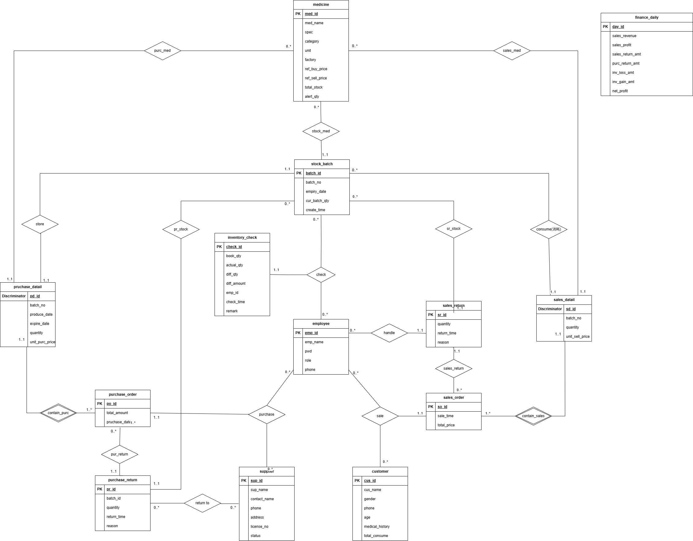

# 《数据库系统》课程设计报告

## 基本信息

**题目**：医药销售管理系统

**小组成员信息**：

| 姓名 | 学号 | 分工 |
|------|------|------|
| 周宏杰 | 23336346 | 承担数据库管理员工作，完成数据库关系模式和物理模式设计，并且实现了软件的部分功能 |
|        |          |                                                              |
|      |      |                                                              |

## 一、开发环境与开发工具

（待补充）

## 二、系统需求分析（5分）

（待补充）

## 三、功能需求分析（10分）

（待补充）

## 四、系统设计（25分）

### 4.1 数据概念结构设计（系统ER图）（10分）

### 4.2 数据库关系模式设计（10分）

根据er图，可以得到数据库的关系模式：

#### 4.2.1 关系模式

##### 药品表
medicine(med_id, med_name, spec, category, unit, factory, ref_buy_price, ref_sell_price, total_stock, alert_qty)
主键：med_id

##### 供应商表
supplier(sup_id, sup_name, contact_name, phone, address, license_no, status)
主键：sup_id

##### 员工表
employee(emp_id, emp_name, pwd, role, phone)
主键：emp_id

##### 客户表
customer(cus_id, cus_name, gender, phone, age, medical_history, total_consume)
主键：cus_id

##### 采购订单表
purchase_order(po_id, total_amount, purchase_date, sup_id, emp_id)
主键：po_id 外键：sup_id, emp_id

##### 采购明细表
purchase_detail(pd_id, med_id, batch_no, produce_date, expire_date, quantity, unit_purc_price, po_id)
主键：pd_id 外键：med_id, po_id

##### 库存批次表
stock_batch(batch_id, med_id, pd_id, batch_no, expiry_date, cur_batch_qty, create_time)
主键：batch_id 外键：med_id, pd_id

##### 销售订单表
sales_order(so_id, sale_time, total_price, cus_id, emp_id)
主键：so_id 外键：cus_id, emp_id

##### 销售明细表
sales_detail(sd_id, med_id, batch_id, quantity, unit_sell_price, so_id)
主键：sd_id 外键：med_id, batch_id, so_id

##### 库存盘点表
inventory_check(check_id, batch_id, book_qty, actual_qty, diff_qty, diff_amount, emp_id, check_time, remark)
主键：check_id 外键：batch_id, emp_id

##### 销售退货表
sales_return(sr_id, so_id, emp_id, batch_id, quantity, return_time, reason)
主键：sr_id 外键：so_id, emp_id, batch_id

##### 采购退货表
purchase_return(pr_id, po_id, sup_id, batch_id, quantity, return_time, reason)
主键：pr_id 外键：po_id, sup_id, batch_id

#### 4.2.2 视图设计
- v_expired_drugs：筛出 6 个月内到期批次，给到期状态与剩余天数，驱动近效期处理。
- v_low_stock：基于 alert_qty 计算缺口，生成缺货/低库存预警清单。
- v_stock_detail：批次级存量明细，附 is_expired 标记，支持前端批次选取。
- v_sales_statistics：按日汇总订单数、销量、销售额，供运营日报。
- v_top_selling：TOP10 畅销药品（销量/收入/订单数），供补货与陈列决策。

#### 4.2.3 触发器设计
- trg_after_purchase_detail_insert：进货明细入库，若批次不存在则建批次，否则累加；同步更新 t_medicine.total_stock。
- trg_after_sales_detail_insert：销售明细出库，扣减批次与总库存，防止超卖。
- trg_after_sales_return_insert：销售退货入库，批次与总库存回补。
- trg_after_purchase_return_insert：采购退货出库，批次与总库存扣减。
- trg_after_inventory_check_insert：盘点后以实物数覆盖批次库存，并按差异调整总库存。

#### 4.2.4 函数与存储过程
- fn_generate_po_id：按日期生成采购单号，格式 PyyyyMMddNNNN，同一日内基于最大序号+1 递增，保证流水唯一性。
- fn_generate_so_id：按日期生成销售单号，格式 SyyyyMMddNNNN，与采购单号逻辑一致，用于前端/接口自动取号。
- sp_monthly_report(year, month)：生成指定年月的运营汇总，返回月份名称、销售额、订单数与盘点差异金额，可供财务报表/仪表盘调用。
- sp_daily_finance_settlement(date)：按日汇总销售收入、估算毛利、销售退货、购进退出及盘点盈亏，写入 t_finance_daily；日结路由通过 CALL sp_daily_finance_settlement(p_date) 触发。
### 4.3 数据库物理结构设计（5分）

#### 4.3.1 存储与实例参数
- 引擎与字符集：全库使用 InnoDB引擎，utf8mb4字符，隔离级别 REPEATABLE READ。
- 关键参数（可覆盖默认）：innodb_buffer_pool_size=物理内存 70%-80%；innodb_log_file_size≈1G；sys 库启用。

#### 4.3.2 表与列的物理定义
- 主键全部自增/定长整数，避免随机 UUID 碎片；金额列 DECIMAL(10,2)/(12,2)；age/quantity 等列使用 CHECK 约束；批次号、手机号使用 UNIQUE 约束。
- 全表增加 created_at，部分表增加 updated_at，便于统计。

#### 4.3.3 索引与访问路径（B+ 树）
- InnoDB 聚簇索引+二级索引均为 B+ 树，自适应哈希由 InnoDB 自动启用。
- 已建的二级索引：
  - t_medicine_name(med_name)
  - t_medicine_category(category)
  - t_stock_expiry(expiry_date)
  - t_purchase_date(purchase_date)
  - t_sales_time(sale_time)
  - t_supplier_name(sup_name)

#### 4.3.4 分区与归档
- RANGE（月）分区：t_sales_order、t_purchase_order 按 sale_time/purchase_date 按月建分区，便于裁剪历史扫描。
- HASH 分区：t_stock_batch 按 med_id HASH，分散单品热点批次查询。
- 归档策略：保留 24 个月热数据，历史分区转存归档表或冷库，再做 DROP PARTITION 缩减主库体量。

#### 4.3.5 日志、监控
- 慢日志：long_query_time=1s，log_queries_not_using_indexes=ON，周度审查慢语句并优化。
- 运行监控：拉取 QPS、事务、redo、buffer pool 命中率，进行Grafana 报警阈值。

#### 4.3.6 备份与恢复
- 备份：每日全量备份，每小时增量 binlog 归档到对象存储；保留策略 30 天。
- 高可用与读写分离：主库写、只读从库提供查询与报表，半同步或异步复制；定期测试确保可用。

## 五、系统功能的实现（10分）

（待补充）

## 六、总结

（待补充）

## 附录

（待补充）
