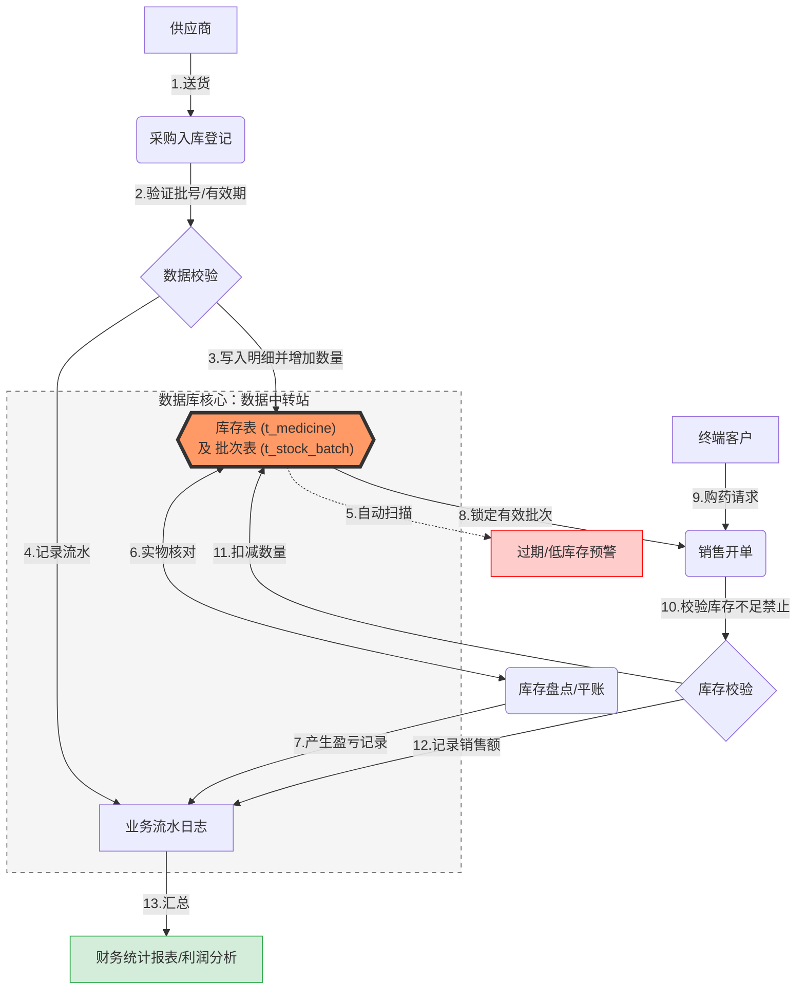

# 医药销售管理系统 - 需求规格说明书

## 1. 项目概述

### 1.1 编写目的

本文档旨在明确“医药销售管理系统”的功能需求与业务逻辑，为数据库逻辑结构设计及前端界面开发提供统一的技术准则。

### 1.2 业务背景

医药行业对药品的时效性（有效期）、合规性（批号管理）有极高要求。本项目旨在构建一个信息化平台，实现药品从进货入库、库存盘点到销售出库的全流程闭环管理，并提供财务分析功能。

------

## 2. 角色定义（用户视图）

系统预设四类核心角色：

- **系统管理员**：负责员工账号维护、权限分配及系统初始化。
- **库管员**：负责药品入库登记、库存盘点、过期药品退货处理。
- **销售员**：负责前端销售登记、客户信息录入及退货处理。
- **财务经理**：负责查看销售统计报表、毛利计算及库存资产评估。

------

## 3. 功能需求详述

### 3.1 基础信息管理 

- **药品字典维护**：记录药品编码、通用名、剂型（片剂/胶囊等）、规格、生产厂家、单位、进价、售价。
- **往来单位管理**：
  - **供应商**：名称、联系人、电话、资质证书编号。
  - **客户**：姓名、联系电话、过敏史（保障客户的用药安全）。
- **员工档案**：姓名、职位、工号/账号、密码。

### 3.2 进货管理

- **入库登记**：录入进货单据。**必须包含：药品ID、进货批号（Batch No）、生产日期、有效期（Expiry Date）、进货数量、采购单价。**
- **入库查询**：支持按日期、供应商、药品名查询历史入库记录。
- **自动入库逻辑**：提交入库单后，系统应自动增加该药品的总库存数量，并在“库存批次表”中新增一条记录。

### 3.3 库房管理 

- **库存查询**：多维度展示库存（按药品统计总数、按批号查看明细）。
- **盘点功能**：记录账面数量与实物数量的差异，生成盘点盈亏表。若账面数量和实物数量不符，则需要更新账面数量，同时更新盈亏金额。盘点产生的差异数量将结合药品单价，自动计入**财务损益统计**。盘盈增加营业外收入，盘亏计入管理费用，从而保证财务报表的真实性。”
- **有效期预警**：**核心功能**。系统自动筛选出距失效日期 6 个月以内的药品并标红。
- **库存预警**：当某药品的总库存低于设定的临界值（如 50 盒）时，系统提示补货。

### 3.4 销售管理 

- **销售登记**：选择药品 -> 校验库存 -> 选择批号（默认先进先出） -> 录入数量 -> 生成销售金额。
- **销售退货**：支持按订单退货，退货后库存需自动回滚。
- **约束条件**：**已过期的药品在销售选择界面应被锁定，禁止开单。**

### 3.5 财务统计 

- **日/月销售报表**：统计指定时间段内的销售总额、实收金额。
- **利润分析**：根据 `(销售价 - 采购价) * 数量` 计算毛利。
- **畅销榜单**：统计销售量前 10 的药品，辅助采购决策。

------

## 4. 业务流程图 

此流程图描述了从采购入库到终端销售的核心逻辑，强调了库存表作为数据中转站的核心地位。

------

## 5. 数据约束与非功能需求

- **数据一致性**：销售行为必须与库存扣减构成一个**数据库事务**，确保不会出现“卖了药但库存没减”的情况。
- **安全性**：用户密码需加密存储；非财务角色禁止查看利润数据。
- **并发控制**：防止两个销售员同时卖出最后一份药品（数据库锁机制）。

------

## 6. 数据库技术点应用

为了符合课程设计要求，本系统将重点实现：

1. **触发器 (Trigger)**：实现入库/出库时，`t_medicine` 表总库存字段的自动累加与回扣。
2. **存储过程 (Stored Procedure)**：编写复杂的月度财务结算逻辑。
3. **视图 (View)**：创建 `v_expired_drugs`（过期药品视图）和 `v_low_stock`（缺货视图）。
4. **索引 (Index)**：在药品名称和批号上建立索引，优化海量数据的查询速度。

